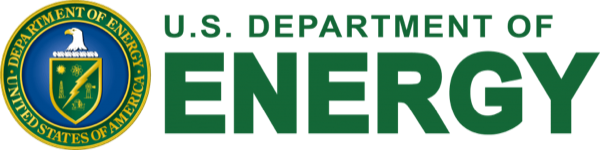

# Acknowledgements

quantEM is developed by researchers at [Stanford University](https://www.stanford.edu/), [Lawrence Berkeley National Laboratory](https://www.lbl.gov/), [TU Delft](https://www.tudelft.nl/en/), and partner institutions, with contributions from the wider electron microscopy community. See [Contribute](./contribute.md) to get involved.

## Funding

Development of quantEM has been supported by:

:::{div}
:class: qem-funders qem-only-light

:::

:::{div}
:class: qem-funders qem-only-dark

:::

## Software

quantEM builds on the scientific Python ecosystem, in particular [PyTorch](https://pytorch.org), [NumPy](https://numpy.org), [SciPy](https://scipy.org), [Zarr](https://zarr.dev), [RosettaSciIO](https://hyperspy.org/rosettasciio/), [scikit-image](https://scikit-image.org), [Optuna](https://optuna.org), and [Matplotlib](https://matplotlib.org).

The interactive viewers are built with [anywidget](https://anywidget.dev).

This documentation is written in [MyST Markdown](https://mystmd.org), an open source scientific publishing toolchain developed by [Curvenote](https://curvenote.com/).
